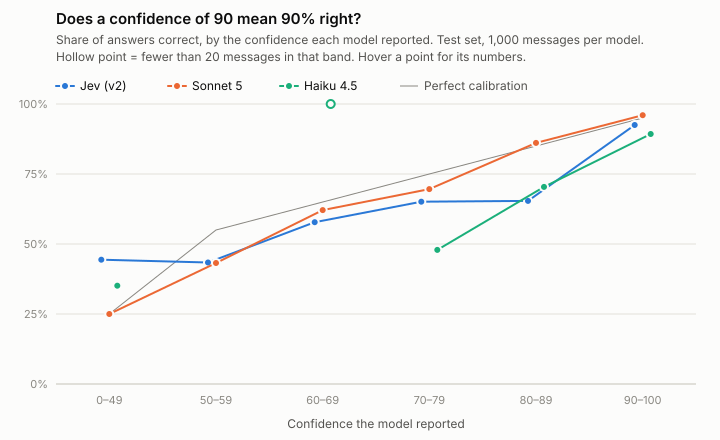

# Jev in a closed-loop gate: Banking77 results

**Verdict (pre-registered): Jev wins.** At the 70% auto-accept row, Jev's accuracy on the messages it auto-accepted was **91.4%**, against Claude Sonnet 5's **91.0%**, at **$0.10 vs $5.25 per 1,000 messages (52× cheaper)**. The accuracy gap is well inside sampling noise, so read it as a tie on accuracy and a large win on cost, not as "Jev is more accurate than Sonnet".

*Build dates: September 27–28, 2026. All code, logs and description versions are in the [repository](https://github.com/danielwipert/jev.sorter).*

---

## 1. The question

A decision model at the front of a pipeline has to do two things: pick an answer, and say how sure it is so the pipeline knows what it can auto-accept. **Which model, sitting in the same Python-gated pipeline, auto-accepts the most messages with the fewest confident-and-wrong answers, and at what cost?** We held the harness fixed and swapped the model: TypeSafe's **Jev** (`typesafe/jev-1.13`), **Claude Sonnet 5** and **Claude Haiku 4.5**, all through OpenRouter.

## 2. The harness

```
   ┌──────────┐     ┌──────────┐     ┌──────────┐     ┌──────────┐
   │ 1.DECIDE │ ──> │ 2. GATE  │ ──> │ 3. CHECK │ ──> │ 4. LEARN │
   └──────────┘     └──────────┘     └──────────┘     └──────────┘
        ^                                                   │
        └───────────────────────────────────────────────────┘
```

| Stage | What happens |
|---|---|
| 1. Decide | The model returns one of 77 categories and a confidence from 0 to 100. This is the only part that changes between contenders. |
| 2. Gate | Deterministic checks first, then the confidence threshold. Pass means auto-accept; fail means review, with the reason logged. |
| 3. Check | The answer is compared with the Banking77 label. |
| 4. Learn | The most-confused category pairs are found, Claude Sonnet 5 drafts clearer descriptions, a human approves or edits them, and a new version is saved. |

**The gate ([`gate.py`](https://github.com/danielwipert/jev.sorter/blob/main/gate.py))** runs four checks in order. The first failure sends the message to review:

| # | Check | Fail reason |
|---|---|---|
| 1 | Is the answer *exactly* one of the 77 category names? | `invalid_category` |
| 2 | Is the message non-empty? | `empty_input` |
| 3 | Does the message contain at least one keyword of the chosen category? | `keyword_miss` |
| 4 | Is confidence at or above this model's threshold? | `low_confidence` |

The first three checks involve no model, so a model can be 100% confident in a broken answer and it still won't be auto-accepted. Check 3 started as a logged flag and was promoted to blocking after the first Jev run: it flagged only 1.5% of correct answers but 14.3% of wrong ones. That decision is recorded in the [changelog](https://github.com/danielwipert/jev.sorter/blob/main/CHANGELOG.md).

## 3. What was tested

**Data.** [Banking77](https://github.com/PolyAI-LDN/task-specific-datasets) customer messages, 77 intents. We used a 500-message **tuning set** from the train split and a 1,000-message **test set** from the test split, both drawn once with seed 42 and committed. The test set was not opened until tuning was finished.

**Contenders.** All contenders saw the same 1,000 test messages.

| ID | Setup |
|---|---|
| A | Jev, descriptions v1 (category names only) |
| B | Jev, final tuned descriptions (v2) |
| C | Claude Sonnet 5, final descriptions (v2) |
| D | Claude Haiku 4.5, final descriptions (v2) |
| E | Cascade: Jev's answer if Jev auto-accepts it, otherwise Sonnet's. Computed from the B and C logs, with no new calls. |

**Versions.** `typesafe/jev-1.13` (reported as `typesafe/jev-1.13-20260917`), `anthropic/claude-sonnet-5`, `anthropic/claude-haiku-4.5`. Claude got one fixed, simple prompt: the 77 names and descriptions, the message, and a request for `{"category", "confidence"}` in JSON. It made one call per message, with extended thinking off. Jev's confidence is its native score (0–1, multiplied by 100).

**Thresholds.** Each model got its own thresholds, read off its **tuning** run at the points where 50%, 70% and 85% of tuning messages would be auto-accepted. Those exact thresholds were then applied, unchanged, to the test set.

**The pre-registered bar** (copied verbatim from the spec, written before the first run):

> **Jev wins** if, at the 70% auto-accept row on the final test set:
> - its accuracy on auto-accepted messages is within **3 points** of Sonnet 5's, **and**
> - its cost per 1,000 gated decisions is at least **10x lower** than Sonnet 5's.
>
> The 50% and 85% rows are supporting evidence: they show whether the gap widens or narrows as each model is pushed into its less-confident answers.
>
> **"Not yet"** if Jev misses either condition. The headline then reads "not yet the right gate for this task," and the cascade (contender E) is reported alongside as the practical alternative.

## 4. Results (test set, 1,000 messages)

**Accuracy on auto-accepted messages:**

| Contender | Target auto-accept | Threshold | Realized auto-accept | Accuracy on auto-accepted | Soft hallucination rate | Hard hallucination rate | Cost per 1,000 |
|---|---|---|---|---|---|---|---|
| A: Jev v1 | 50% | 97 | 54.7% | 96.0% | 4.0% | 0.0% | $0.07 |
| A: Jev v1 | 70% | 84 | 72.5% | 90.5% | 9.5% | 0.0% | $0.07 |
| A: Jev v1 | 85% | 61 | 86.0% | 85.7% | 14.3% | 0.0% | $0.07 |
| **B: Jev v2** | 50% | 98 | 54.2% | **97.0%** | 3.0% | 0.0% | **$0.10** |
| **B: Jev v2** | **70%** | 85 | 73.1% | **91.4%** | 8.6% | 0.0% | **$0.10** |
| **B: Jev v2** | 85% | 64 | 86.2% | **87.4%** | 12.6% | 0.0% | **$0.10** |
| C: Sonnet 5 | 50% | 85 | 64.5% | 93.8% | 6.2% | 0.0% | $5.25 |
| C: Sonnet 5 | **70%** | 75 | 75.3% | 91.0% | 9.0% | 0.0% | $5.25 |
| C: Sonnet 5 | 85% | 65 | 87.4% | **87.4%** | 12.6% | 0.0% | $5.25 |
| D: Haiku 4.5 | 50% | 92 | 58.7% | 89.4% | 10.6% | 0.2% | $1.90 |
| D: Haiku 4.5 | 70% | 85 | 81.4% | 84.6% | 15.4% | 0.2% | $1.90 |
| D: Haiku 4.5 | 85% | 75 | 89.1% | 81.6% | 18.4% | 0.2% | $1.90 |

*Soft hallucination rate* = 1 − accuracy on auto-accepted (confident and wrong). *Hard hallucination rate* = share of all answers that failed check 1.

**Accuracy on all 1,000 answers, before any gating:** Jev v1 79.3%, Jev v2 81.6%, **Sonnet 5 82.3%**, Haiku 4.5 76.9%.

**Cascade (E):** Jev answers what it auto-accepts, and Sonnet answers the rest. Every message gets an answer.

| Jev target | Jev handles | Accuracy, Jev's share | Accuracy, Sonnet's share | Accuracy overall | Cost per 1,000 |
|---|---|---|---|---|---|
| 50% | 54.2% | 97.0% | 65.1% | 82.4% | $2.51 |
| **70%** | 73.1% | 91.4% | 59.5% | **82.8%** | **$1.51** |
| 85% | 86.2% | 87.4% | 57.2% | 83.2% | $0.83 |

Sonnet alone on every message: 82.3% at $5.25 per 1,000. At the 70% row the cascade was slightly more accurate for about 29% of the cost.

**Calibration.** The gray line is where a model would sit if its confidence matched its accuracy exactly.

<object data="calibration.svg" type="image/svg+xml" style="width:100%;max-width:720px" aria-label="Calibration chart">
  
</object>

| Confidence band | Jev v2: messages | Jev v2: right | Sonnet 5: messages | Sonnet 5: right | Haiku 4.5: messages | Haiku 4.5: right |
|---|---|---|---|---|---|---|
| 0–49 | 45 | 44.4% | 32 | 25.0% | 74 | 35.1% |
| 50–59 | 53 | 43.4% | 37 | 43.2% | 0 | – |
| 60–69 | 64 | 57.8% | 103 | 62.1% | 2 | 100.0% |
| 70–79 | 63 | 65.1% | 138 | 69.6% | 94 | 47.9% |
| 80–89 | 81 | 65.4% | 237 | 86.1% | 240 | 70.4% |
| 90–100 | 694 | 92.5% | 453 | **96.0%** | 590 | 89.3% |

Sonnet 5 is the best calibrated: when it says 90 or more, it is right 96% of the time. Jev is the most willing to be confident (694 answers at 90+), and those answers are right 92.5% of the time. Haiku says 90+ often and is right least often.

## 5. Verdict

| Condition at the 70% row | Jev (B) | Sonnet 5 (C) | Needed | Result |
|---|---|---|---|---|
| Accuracy on auto-accepted | 91.4% | 91.0% | Jev within 3 points | **Pass** (Jev +0.4) |
| Cost per 1,000 | $0.10 | $5.25 | Jev at least 10× cheaper | **Pass** (52×) |

**Jev wins, by the rule written before the first run.** The supporting rows agree: Jev is ahead by 3.2 points at 50% and level at 85%.

**Secondary results, reported regardless of the verdict:**

- **What the loop added (B vs A):** +0.9 points at the 70% row, +1.0 at 50%, +1.7 at 85%, and +2.3 points on all answers. On the tuning set, the loop looked worth about 3 points. Part of that was fitting to the tuning messages, which is what the locked test set is for.
- **A second tuning round was tried and gave no net gain.** On tuning it fixed 16 answers and broke 18, so v2 was kept as final and v3 stays in the repo, unused.
- **Hard hallucinations:** Jev 0 and Sonnet 0 out of 1,000. Haiku 2 out of 1,000: both were a valid JSON answer followed by extra commentary ("Wait, let me reconsider…"), which made the reply unreadable. They count under the rules, but neither would have been auto-accepted.

## 6. Caveats

- **Banking77 is not email.** These are short chat messages, with no subject lines, signatures or threads. The results are a proxy for email triage, not proof of it.
- **The descriptions were tuned on Jev's mistakes, then handed to Claude.** This tilts the comparison slightly toward Jev. The optional check on this tilt (contender F, Sonnet with v1 descriptions) was not run.
- **"70%" did not mean the same volume for every model.** Claude's self-reported confidences cluster on round numbers (85, 90, 95), so a threshold can't stop at exactly 70%. At the 70% row Sonnet auto-accepted 75.3% of messages and Jev 73.1%. As a supporting check outside the pre-registered rule, comparing each model's 730 most confident valid answers gives Jev 91.4% and Sonnet 91.8%. The verdict holds either way.
- **The accuracy difference is within noise.** With about 730 auto-accepted answers per model, one standard error on each accuracy figure is roughly ±1 point. Treat 91.4% vs 91.0% as equal.
- **Each model was run once.** Run-to-run variation was not measured.
- **Jev is a beta product** (launched mid-September 2026), with vendor-run benchmarks. Pricing, limits and versions may change. Pinning `jev-1.13` protects this comparison, not future ones.
- **Claude's confidence is self-reported** from one call, with no sampling. That's the honest form of "swap the model, keep the harness". Its calibration is part of the finding, not a bug we engineered around.
- **Disclosure:** the rewritten category descriptions were drafted by Claude Sonnet 5 and approved or edited by a human. Every draft, every edit and every call's cost is in the repo.
- **Total spend for the whole project: $11.20** (Sonnet $7.88, Haiku $2.86, Jev $0.32, drafting $0.14).

## 7. Phase 2

- Repeat on **real emails**, with subjects, signatures and threads, labeled by a person. The source inbox, the labeler and the size are still to be decided.
- Lift `gate.py` unchanged into that pipeline. The `empty_input` check exists for this.
- Try **sampled agreement** for Claude's confidence, instead of a self-reported number, to see whether it fixes the round-number problem.
- Run each model several times to measure run-to-run variation.

## 8. Check any number

Every number above can be recomputed with `python analyze.py`.

- Decision logs, one row per message per run: [`logs/`](https://github.com/danielwipert/jev.sorter/tree/main/logs)
- Result tables: [`results/`](https://github.com/danielwipert/jev.sorter/tree/main/results)
- Category descriptions [v1](https://github.com/danielwipert/jev.sorter/blob/main/categories/v1.json), [v2 (final)](https://github.com/danielwipert/jev.sorter/blob/main/categories/v2.json), [v3 (unused)](https://github.com/danielwipert/jev.sorter/blob/main/categories/v3.json), and [keywords v1](https://github.com/danielwipert/jev.sorter/blob/main/keywords/v1.json)
- Sonnet's original drafts, the approved versions and every drafting call: [`drafts/`](https://github.com/danielwipert/jev.sorter/tree/main/drafts)
- What changed in each version and why: [`CHANGELOG.md`](https://github.com/danielwipert/jev.sorter/blob/main/CHANGELOG.md)
- The spec this was built from: [`planning/`](https://github.com/danielwipert/jev.sorter/tree/main/planning)
